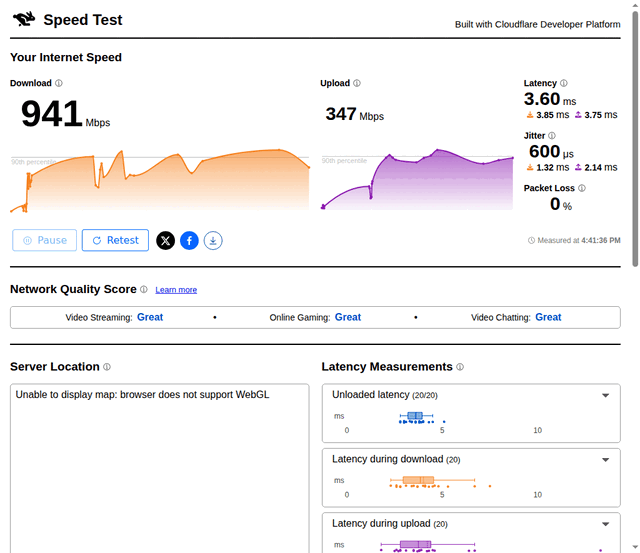

# CLAUDE.md

## 言語設定

- 会話・技術説明・コード内コメントはすべて日本語で記述する
- docstring は英語で記述する（pydoc / IDE 向け）
- README.md は英語、README.ja.md は日本語

## プロジェクト概要

Selenium を使って複数の速度テストサイト（Cloudflare, Netflix/fast.com, Google Fiber, Ookla, Box-test, M-Lab, USEN, iNonius）を自動実行し、結果を Zabbix や Grafana Cloud へ送信するツール。

## アーキテクチャ

- `speedtest_z/cli.py` — CLI エントリポイント（`main()`）
- `speedtest_z/runner.py` — SpeedtestZ コアクラス（WebDriver 管理・結果送信）
- `speedtest_z/grafana.py` — Grafana Cloud Prometheus Remote Write 送信（Protobuf エンコーダー + GrafanaSender）
- `speedtest_z/config.py` — 設定ファイル探索・ログ設定
- `speedtest_z/i18n.py` — ロケール判定・メッセージ辞書
- `speedtest_z/output.py` — JSON/CSV 出力（OutputCollector）
- `speedtest_z/healthcheck.py` — `--check` URL 疎通確認
- `speedtest_z/types.py` — ZabbixItem TypedDict
- `speedtest_z/sites/` — サイトごとのランナー（`run_xxx(app)` 関数）
- `speedtest_z/__init__.py` — バージョン情報（setuptools-scm で自動採番）
- `config.ini` — 実行設定（探索順: CWD → ~/.config/speedtest-z/）
- `logging.ini` — ログ設定（同上）
- `deploy/` — systemd service/timer, cron（デプロイ参考用）
- `speedtest-z_templates.yaml` — Zabbix テンプレート

## コマンド

```bash
# 開発用インストール
python3 -m venv .venv
. .venv/bin/activate
pip install -e .
# Grafana Cloud 連携を使う場合
pip install -e ".[grafana]"

# lint / format
ruff check speedtest_z/ tests/
ruff format --check speedtest_z/ tests/

# テスト
pytest tests/ -v

# CLI
speedtest-z --version
speedtest-z --list-sites
speedtest-z --check
speedtest-z --dry-run
speedtest-z --dry-run cloudflare netflix
speedtest-z --dry-run --output json cloudflare

# パッケージビルド
pip install build
python -m build
```

## CI/CD

- `.github/workflows/ci.yml` — push/PR 時に構文チェック + ビルドテスト（Python 3.10〜3.14）
- `.github/workflows/release.yml` — `v*` タグ push 時に PyPI へ自動公開（Trusted Publishers）

## リリース手順

タグを打つ前に以下のドキュメントが最新か確認し、必要なら更新してから commit & push すること:

1. **README.md / README.ja.md** — 新しい CLI オプション・機能・対応サイトの追記
2. **CHANGELOG.md** — リリースエントリの追加
3. 上記を commit & push してからタグを作成する

**重要: PyPI はバージョンの上書きを許可しない。** 一度タグを push して PyPI に公開されたバージョンは、タグを削除・再作成しても同じバージョン番号では再公開できない。ドキュメント修正のみでもパッチバージョンを上げること（例: v0.5.0 → v0.5.1）。

## config.ini の設計

- `[general]` の `dry_run`（旧名 `dryrun` もフォールバックでサポート）
- `[zabbix]` に `enable` フラグ（デフォルト `false`）。`enable = true` で Zabbix 送信が有効
- `[grafana]` セクション（オプション）。`enable = true` + `remote_write_url` / `username` / `token` で Grafana Cloud 送信
- `--dry-run` 時は Zabbix も Grafana も送信しない（外部送信を全て止める一貫したルール）
- `--output json/csv` 時は stdout 出力のみ（バックエンド送信なし）
- `cramjam` は optional dependency: `pip install speedtest-z[grafana]`
- `send_results()` が全バックエンド（Zabbix + Grafana）への送信を一括管理

## 注意事項

- `config.ini` は `.gitignore` で除外（`config.ini-sample` をコピーして使用）
- Chrome ブラウザが実行環境に必要（pip では入らない）
- テストサイトの DOM 構造変更によりセレクタが壊れる可能性がある（定期的な確認が必要）
- `-y` / `--yes` は隠しオプション（`argparse.SUPPRESS`）。README や CHANGELOG に記載しないこと
- `grafana-dashboard.json` は開発中のため未コミット。実機で熟成してからレポジトリに追加する

## README スクリーンショットの差し替え手順

README に埋め込む animation GIF (`docs/demo.gif`) の更新手順。

```bash
# 1. 全サイト計測（snapshot が snapshots/ に保存される）
speedtest-z --dry-run

# 2. frequency でスキップされたサイトがあれば明示指定で再実行
speedtest-z --dry-run ookla mlab

# 3. 8サイト分の PNG から animation GIF を生成（3秒/枚、640px幅）
magick \
  -delay 300x100 snapshots/cloudflare.png \
  -delay 300x100 snapshots/netflix.png \
  -delay 300x100 snapshots/google.png \
  -delay 300x100 snapshots/ookla.png \
  -delay 300x100 snapshots/boxtest.png \
  -delay 300x100 snapshots/mlab.png \
  -delay 300x100 snapshots/usen.png \
  -delay 300x100 snapshots/inonius.png \
  -resize 640x -loop 0 docs/demo.gif

# 4. ブラウザで確認（macOS Preview は GIF アニメ非対応）
open -a "Google Chrome" docs/demo.gif

# 5. README への埋め込み（両方に追加）
#   README.md:    
#   README.ja.md: 
```

- `magick` (ImageMagick) が必要: `brew install imagemagick`
- delay 値: 100=1秒, 200=2秒, 300=3秒（現在は3秒/枚を採用）
- ディゾルブ（`-morph`）はファイルサイズが大幅に増えるため不採用

## テストサイト固有の注意

- **Google Fiber** (`speed.googlefiber.net`): HTTPS 非対応。HTTP のみで接続すること。安易に https:// に変更しないこと
- **Netflix** (`fast.com`): `/ja/` 等の言語パスを付けない。ブラウザのロケールで自動判定される
