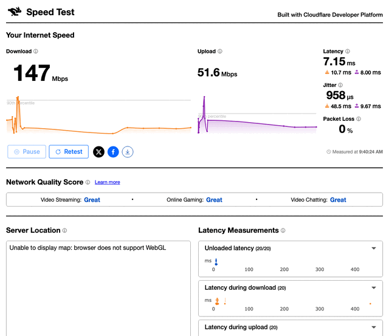

# speedtest-z

[English](README.md)

Seleniumを使った複数サイト速度テスト自動実行ツール。Zabbix トラッパー連携対応。



## 特徴

- 8つの速度テストサイトを自動実行（Cloudflare, Netflix/fast.com, Google Fiber, Ookla, Box-test, M-Lab, USEN, inonius）
- Zabbixへトラッパーアイテムとして結果送信（[zappix](https://pypi.org/project/zappix/) 使用）
- サイトごとの実行頻度設定（確率ベースのスロットリング）
- デバッグ用スクリーンショット保存
- ヘッドレス/GUI Chromeモード切替
- CLI対応（`--dry-run`、サイト指定等）
- systemd timerによるスケジュール実行

## 前提条件

- Python >= 3.10
- Google Chrome ブラウザ（pip ではインストールされません）

## インストール

```bash
pip install speedtest-z
```

### 開発用インストール

```bash
git clone https://github.com/shigechika/speedtest-z.git
cd speedtest-z
python3 -m venv .venv
. .venv/bin/activate
pip install -e .
```

### 依存ライブラリ

- [selenium](https://pypi.org/project/selenium/) — ブラウザ自動操作
- [zappix](https://pypi.org/project/zappix/) — Zabbix トラッパー送信

## 設定ファイル

### config.ini

設定ファイルは以下の順序で探索されます（`-c` / `--config` で明示指定も可能）：

1. CLI で指定されたパス（`-c` / `--config`）
2. カレントディレクトリの `./config.ini`
3. `~/.config/speedtest-z/config.ini`（XDG_CONFIG_HOME）

`config.ini-sample` をコピーして編集してください。

#### `[general]` セクション

```ini
[general]
# 実行モード設定
dryrun = true           # true にすると Zabbix へ送信しない
headless = true         # ヘッドレスモード（GUI なし）
timeout = 30            # 各テストのタイムアウト（秒）
# ookla_server = IPA CyberLab   # Ookla テストサーバ（省略時: 自動選択）
```

#### `[zabbix]` セクション

```ini
[zabbix]
server = 127.0.0.1      # 送信先 Zabbix Server
port = 10051             # Zabbix トラッパーポート
host = speedtest-agent   # Zabbix ホスト名
```

#### `[snapshot]` セクション

```ini
[snapshot]
enable = true            # 画面キャプチャの有効/無効
save_dir = ./snapshots   # スクリーンショット保存先
```

#### `[frequency]` セクション

各サイトの実行確率を 0〜100 で設定します。0 で無効化、100 で毎回実行、50 で約半分の確率で実行されます。

```ini
[frequency]
cloudflare = 100
netflix = 100
google = 100
ookla = 50
boxtest = 50
mlab = 10
usen = 50
inonius = 50
```

### logging.ini

`config.ini` と同じ探索順で検索されます（任意）：

1. カレントディレクトリの `./logging.ini`
2. `~/.config/speedtest-z/logging.ini`（XDG_CONFIG_HOME）

どちらも見つからない場合は、デフォルトのログ設定（INFO レベル、stdout 出力）が使用されます。

## 使い方

```
speedtest-z [options] [site ...]
```

### CLIオプション

| オプション | 説明 |
|-----------|------|
| `-V`, `--version` | バージョン表示 |
| `-c`, `--config CONFIG` | 設定ファイル指定 |
| `-n`, `--dry-run` | テスト実行（Zabbix へ送信しない） |
| `--headless` | ヘッドレスモードで実行 |
| `--no-headless`, `--headed` | GUI モードで実行 |
| `--timeout SECONDS` | 各テストのタイムアウト（秒） |
| `--list-sites` | 利用可能なテストサイト一覧を表示して終了 |
| `-d`, `--debug` | デバッグ出力を有効化 |
| `site` | 実行するテストサイト（位置引数、省略時は全サイト） |

### 実行例

```bash
# 全サイトをテスト実行（Zabbix に送信しない）
speedtest-z -n

# 特定サイトのみ実行
speedtest-z cloudflare netflix

# GUI モードでデバッグ実行
speedtest-z --no-headless -d google

# 利用可能なサイト一覧を表示
speedtest-z --list-sites
```

## 実行例

JANOG57 Meeting（2026年2月、大阪）にて計測:

```
$ speedtest-z --dry-run
2026-02-13 09:39:27 [INFO] speedtest-z: START
2026-02-13 09:39:27 [INFO] Config loaded: config.ini
2026-02-13 09:39:27 [INFO] Initializing Chrome WebDriver...
2026-02-13 09:39:28 [INFO] cloudflare: OPEN
2026-02-13 09:39:35 [INFO] cloudflare: Test started
2026-02-13 09:40:24 [INFO] cloudflare: COMPLETED (Quality Scores appeared)
2026-02-13 09:40:27 [INFO] Dryrun: True - Data not sent.
2026-02-13 09:40:27 [INFO] netflix: OPEN
2026-02-13 09:40:53 [INFO] netflix: COMPLETED (succeeded class detected)
2026-02-13 09:40:53 [INFO] google: OPEN
2026-02-13 09:41:20 [INFO] google: COMPLETED
2026-02-13 09:41:20 [INFO] ookla: OPEN (Attempt 1/3)
2026-02-13 09:42:00 [INFO] ookla: COMPLETED
2026-02-13 09:42:02 [INFO] boxtest: OPEN
2026-02-13 09:43:17 [INFO] boxtest: COMPLETED
2026-02-13 09:43:17 [INFO] mlab: OPEN
2026-02-13 09:44:05 [INFO] mlab: COMPLETED
2026-02-13 09:44:05 [INFO] usen: OPEN
2026-02-13 09:44:34 [INFO] usen: COMPLETED (speedtest_wait class removed)
2026-02-13 09:44:34 [INFO] inonius: OPEN
2026-02-13 09:45:31 [INFO] inonius: COMPLETED
2026-02-13 09:45:31 [INFO] speedtest-z: FINISH
```

全8サイトの計測が約6分で完了しています。

## 対応テストサイト

| サイト名 | URL | 取得メトリクス |
|----------|-----|---------------|
| `cloudflare` | https://speed.cloudflare.com/ | download, upload, latency, jitter |
| `netflix` | https://fast.com/ | download, upload, latency, server-locations |
| `google` | https://speed.googlefiber.net/ | download, upload, ping |
| `ookla` | https://www.speedtest.net/ | download, upload, ping |
| `boxtest` | https://www.box-test.com/ | POP, DownloadSpeed, DownloadDuration, DownloadRTT, UploadSpeed, UploadDuration, UploadRTT, latency |
| `mlab` | https://speed.measurementlab.net/ | download, upload, latency, retrans |
| `usen` | https://speedtest.gate02.ne.jp/ | download, upload, ping, jitter |
| `inonius` | https://inonius.net/speedtest/ | IPv4/IPv6 各: DL, UL, RTT, JIT, MSS |

## Zabbix連携

`speedtest-z_templates.yaml` を Zabbix にインポートすると、全テストサイトのアイテムが自動作成されます。

- 全アイテムはトラッパータイプ（`type: TRAP`）
- 速度系アイテムは Mbps → bps への前処理（MULTIPLIER x1000000）付き
- `config.ini` の `[zabbix]` セクションで送信先を設定

```bash
# Zabbix Web UI → 設定 → テンプレート → インポート
# speedtest-z_templates.yaml を選択してインポート
```

## デプロイ（systemd）

`deploy/` ディレクトリに systemd のサービスファイルとタイマーファイルが含まれています。

```bash
# サービスファイルとタイマーファイルをコピー
sudo cp deploy/speedtest-z.service /etc/systemd/system/
sudo cp deploy/speedtest-z.timer /etc/systemd/system/

# 必要に応じてサービスファイルの ExecStart パスを編集
sudo systemctl daemon-reload

# タイマーを有効化・起動（6分間隔で実行）
sudo systemctl enable --now speedtest-z.timer

# 動作確認
systemctl status speedtest-z.timer
systemctl list-timers speedtest-z.timer
```

### Selenium クリーナー（cron）

Chrome の一時ファイルを定期的に削除する cron 設定も含まれています。

```bash
sudo cp deploy/SeleniumCleaner.cron /etc/cron.d/SeleniumCleaner
```

## 計測結果を共有しませんか？

爆速回線や激遅 Wi-Fi の計測結果をお待ちしています！

[GitHub Issues](https://github.com/shigechika/speedtest-z/issues/new?template=speedtest-result.yml) から以下を添えて投稿してください:
- `snapshots/` ディレクトリのスクリーンショット
- CLI ログ出力（`speedtest-z --dry-run`）

データセンターの超高速回線でも、山小屋の激遅 Wi-Fi でも大歓迎です。

## License

[Apache License 2.0](LICENSE)

Copyright 2026 AIKAWA Shigechika
