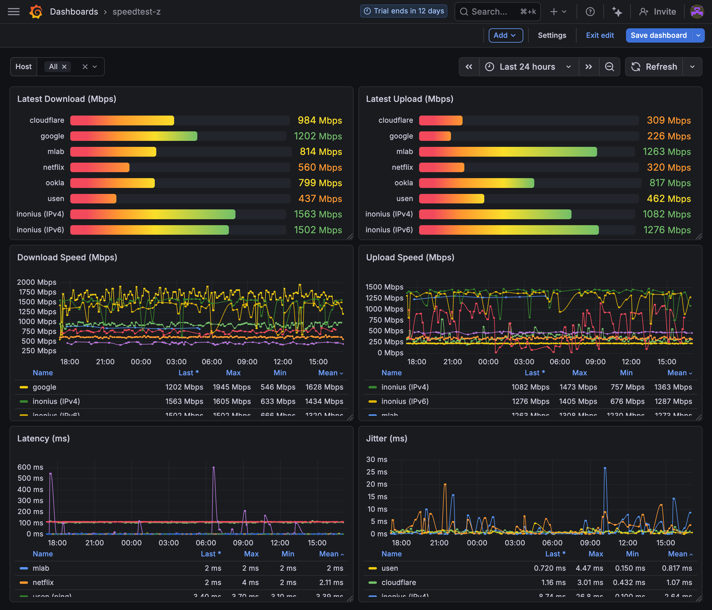

# speedtest-z

[](https://pypi.org/project/speedtest-z/)
[](https://github.com/shigechika/speedtest-z/actions/workflows/ci.yml)
[](https://pypi.org/project/speedtest-z/)

[日本語版 / Japanese](https://github.com/shigechika/speedtest-z/blob/main/README.ja.md)

speedtest-z automates major speed test sites with a web browser, capturing real user-experience network quality for continuous monitoring.

- Supports 8 speed test sites (Cloudflare, Netflix, Ookla, M-Lab, and more)
- Zabbix integration for continuous network quality monitoring
- Quick start: `pip install speedtest-z`


## Features

- Runs speed tests on 8 different sites automatically (Cloudflare, Netflix/fast.com, Google Fiber, Ookla, Box-test, M-Lab, USEN, iNonius)
- Sends results to Zabbix via trapper items (using [zappix](https://pypi.org/project/zappix/))
- Optional Grafana Cloud integration via Prometheus Remote Write
- Optional OpenTelemetry (OTLP) metrics export
- Configurable test frequency per site (probability-based throttling)
- Screenshot capture for debugging
- Headless or GUI Chrome mode
- CLI with `--dry-run`, site selection, etc.
- systemd timer integration for scheduled execution

## Table of Contents

- [Prerequisites](#prerequisites)
- [Installation](#installation)
- [Configuration](#configuration)
- [Usage](#usage)
- [Supported Test Sites](#supported-test-sites)
- [Zabbix Integration](#zabbix-integration)
- [Grafana Cloud Integration](#grafana-cloud-integration)
- [OpenTelemetry (OTLP) Integration](#opentelemetry-otlp-integration)
- [Deployment (systemd)](#deployment-systemd)
- [Troubleshooting](#troubleshooting)
- [License](#license)

## Prerequisites

- Python >= 3.10
- Google Chrome browser (not installable via pip -- must be installed separately)

## Installation

### Homebrew (macOS)

```bash
brew install shigechika/tap/speedtest-z
```

Pre-built bottles are available for macOS Sonoma (14) and Sequoia (15) on Apple Silicon. Installation completes in seconds.

### Debian / Ubuntu (.deb)

Download the `.deb` package for your distribution from [GitHub Releases](https://github.com/shigechika/speedtest-z/releases):

```bash
# Ubuntu 24.04 (Noble)
sudo dpkg -i speedtest-z_*~noble.deb

# Ubuntu 22.04 (Jammy)
sudo dpkg -i speedtest-z_*~jammy.deb
```

The `.deb` package includes all Python dependencies in a self-contained virtualenv (`/opt/venvs/speedtest-z/`), systemd service/timer (installed disabled), and config files in `/etc/speedtest-z/`.

```bash
# Edit config
sudo vi /etc/speedtest-z/config.ini

# Enable scheduled execution (every 10 minutes)
sudo systemctl enable --now speedtest-z.timer
```

### RHEL / Rocky Linux / AlmaLinux (.rpm)

Download the `.rpm` package from [GitHub Releases](https://github.com/shigechika/speedtest-z/releases):

```bash
# RHEL 9 / Rocky Linux 9 / AlmaLinux 9
sudo dnf install python3.11
sudo rpm -ivh speedtest-z-*-1.el9.x86_64.rpm
```

The `.rpm` package has the same structure as the `.deb` package: self-contained virtualenv in `/opt/venvs/speedtest-z/`, systemd service/timer, and config files in `/etc/speedtest-z/`.

### pip / uv

```bash
pip install speedtest-z

# or using uv
uv tool install speedtest-z
```

### Development Setup

```bash
git clone https://github.com/shigechika/speedtest-z.git
cd speedtest-z
python3 -m venv .venv
. .venv/bin/activate
pip install -e .

# or using uv
uv sync
```

### Dependencies

- [selenium](https://pypi.org/project/selenium/) -- Browser automation
- [zappix](https://pypi.org/project/zappix/) -- Zabbix sender protocol

### Grafana Cloud Support (optional)

```bash
pip install speedtest-z[grafana]

# or using uv
uv tool install "speedtest-z[grafana]"
```

This installs `cramjam` for Snappy compression required by Prometheus Remote Write.

### OpenTelemetry Support (optional)

```bash
pip install speedtest-z[otel]

# or using uv
uv tool install "speedtest-z[otel]"
```

This installs the OpenTelemetry SDK and OTLP HTTP exporter for sending metrics via OTLP.

### Zabbix Host Version Tag (optional)

```bash
pip install speedtest-z[zabbix-api]

# or using uv
uv tool install "speedtest-z[zabbix-api]"
```

This installs [zapi-mcp](https://github.com/shigechika/zapi-mcp) so speedtest-z can stamp its running version onto the Zabbix host as a tag (`speedtest-z=<version>`) via the Zabbix JSON-RPC API, alongside the trapper send path. Set `api_url` / `api_user` / `api_password` under `[zabbix]` to enable it.

### Tab Completion (optional)

```bash
pip install speedtest-z[completion]
eval "$(register-python-argcomplete speedtest-z)"
```

Add the `eval` line to your shell profile (`~/.bashrc` or `~/.zshrc`) to enable it permanently.

## Configuration

### config.ini

The configuration file is searched in the following order (`-c` / `--config` can override):

1. `./config.ini` in the current directory
2. `~/.config/speedtest-z/config.ini` (XDG_CONFIG_HOME)
3. `/etc/speedtest-z/config.ini` (system-wide, used by `.deb` package)

Copy `config.ini-sample` to one of these locations and edit as needed.

#### Sections

```ini
[general]
# Run mode
dry_run = true         # true = do not send data to backends
headless = false       # true = run Chrome in headless mode
timeout = 30           # timeout in seconds for each test
# ookla_server = IPA CyberLab 400G   # Ookla test server (omit for auto-select)

[zabbix]
# Zabbix server settings
enable = false           # true = send results to Zabbix
server = 127.0.0.1
port = 10051
host = speedtest-agent   # Zabbix host name for trapper items
# Optional: stamp the version as a host tag (speedtest-z=<version>) via the
# Zabbix API. Requires speedtest-z[zabbix-api]; all three must be set.
# api_url = https://zabbix.example.com/api_jsonrpc.php
# api_user = api-user
# api_password = api-pass

[snapshot]
# Screenshot capture settings
enable = true
save_dir = ./snapshots

[frequency]
# Execution probability per site (0-100)
# 100 = always run, 50 = ~50% chance, 0 = disabled
cloudflare = 100
netflix = 100
google = 100
ookla = 50
boxtest = 50
mlab = 10
usen = 50
inonius = 50

# [grafana]
# # Grafana Cloud Prometheus Remote Write
# enable = false
# remote_write_url = https://prometheus-prod-XX-prod-XX.grafana.net/api/prom/push
# username =
# token =

# [otel]
# # OpenTelemetry (OTLP) metrics export
# enable = false
# endpoint = https://otlp-gateway-prod-XX.grafana.net/otlp
# # Comma-separated Key=Value pairs (same format as OTEL_EXPORTER_OTLP_HEADERS)
# headers = Authorization=Basic <base64-encoded-credentials>
```

> **Note:** The `dryrun` key (without underscore) is still supported for backward compatibility but `dry_run` is preferred.

### logging.ini

An optional `logging.ini` file can be used to customize log output. The file is searched in the same order as `config.ini`:

1. `./logging.ini` in the current directory
2. `~/.config/speedtest-z/logging.ini` (XDG_CONFIG_HOME)
3. `/etc/speedtest-z/logging.ini` (system-wide)

If none is found, the default logging configuration (INFO level to stdout) is used.

## Usage

```
speedtest-z [options] [site ...]
```

### Options

| Option | Description |
|--------|-------------|
| `-V`, `--version` | Show program version and exit |
| `-c`, `--config CONFIG` | Config file path (default: `./config.ini` or `~/.config/speedtest-z/config.ini`) |
| `-n`, `--dry-run` | Test run (do not send data to Zabbix) |
| `--headless` | Run Chrome in headless mode |
| `--no-headless`, `--headed` | Run Chrome with GUI (non-headless) |
| `--timeout SECONDS` | Timeout in seconds for each test |
| `--list-sites` | List available test sites and exit |
| `--check` | Check site URL reachability and exit (no Chrome needed) |
| `-o`, `--output FORMAT` | Output format: `zabbix` (default), `json`, `csv` |
| `-d`, `--debug` | Enable debug output |
| `site` | Positional argument(s): test site(s) to run (default: all) |

### Confirmation Prompt

When run from an interactive terminal (TTY), speedtest-z asks for confirmation before connecting to test sites. Non-interactive environments (cron, systemd, piped input) skip the prompt automatically.

```
$ speedtest-z -n
speedtest-z: connecting to 8 site(s) (cloudflare, netflix, ...)
Continue? [y/N]: y
```

### Examples

```bash
# Run all test sites (dry-run)
speedtest-z -n

# Run specific sites
speedtest-z cloudflare netflix

# Run with GUI browser for debugging
speedtest-z --no-headless -d cloudflare

# List available sites
speedtest-z --list-sites

# Check if all test site URLs are reachable (no Chrome needed)
speedtest-z --check

# Check specific sites only
speedtest-z --check cloudflare netflix

# Output results as JSON (Zabbix send is skipped)
speedtest-z --dry-run --output json cloudflare 2>/dev/null

# Output results as CSV
speedtest-z --dry-run -o csv cloudflare netflix 2>/dev/null
```

## Example Output

```
$ speedtest-z --dry-run
speedtest-z: connecting to 8 site(s) (cloudflare, netflix, google, ookla, boxtest, mlab, usen, inonius)
Continue? [y/N]: y
2026-02-25 15:00:01 [INFO] speedtest-z: START
2026-02-25 15:00:01 [INFO] Config loaded: config.ini
2026-02-25 15:00:01 [INFO] Initializing Chrome WebDriver...
2026-02-25 15:00:02 [INFO] cloudflare: OPEN
2026-02-25 15:00:09 [INFO] cloudflare: Test started
2026-02-25 15:00:58 [INFO] cloudflare: COMPLETED (Quality Scores appeared)
2026-02-25 15:00:58 [INFO] netflix: OPEN
2026-02-25 15:01:24 [INFO] netflix: COMPLETED (succeeded class detected)
2026-02-25 15:01:24 [INFO] google: OPEN
2026-02-25 15:01:51 [INFO] google: COMPLETED
2026-02-25 15:01:51 [INFO] ookla: OPEN (Attempt 1/3)
2026-02-25 15:02:31 [INFO] ookla: COMPLETED
2026-02-25 15:02:33 [INFO] boxtest: OPEN
2026-02-25 15:03:48 [INFO] boxtest: COMPLETED
2026-02-25 15:03:48 [INFO] mlab: OPEN
2026-02-25 15:04:36 [INFO] mlab: COMPLETED
2026-02-25 15:04:36 [INFO] usen: OPEN
2026-02-25 15:05:05 [INFO] usen: COMPLETED (speedtest_wait class removed)
2026-02-25 15:05:05 [INFO] inonius: OPEN
2026-02-25 15:06:02 [INFO] inonius: COMPLETED
2026-02-25 15:06:02 [INFO] speedtest-z: FINISH
```

All 8 sites completed in about 6 minutes.

## Supported Test Sites

| Site | URL | Metrics (Zabbix keys) |
|------|-----|----------------------|
| `cloudflare` | https://speed.cloudflare.com/ | download, upload, latency, jitter |
| `netflix` | https://fast.com/ | download, upload, latency, server-locations |
| `google` | http://speed.googlefiber.net/ | download, upload, ping |
| `ookla` | https://www.speedtest.net/ | download, upload, ping |
| `boxtest` | https://www.box-test.com/ | POP, DownloadSpeed, DownloadDuration, DownloadRTT, UploadSpeed, UploadDuration, UploadRTT, latency |
| `mlab` | https://speed.measurementlab.net/ | download, upload, latency, retrans |
| `usen` | https://speedtest.gate02.ne.jp/ | download, upload, ping, jitter |
| `inonius` | https://inonius.net/speedtest/ | IPv4/IPv6: DL, UL, RTT, JIT, MSS |

All Zabbix item keys are prefixed with the site name (e.g., `cloudflare.download`, `usen.ping`, `inonius.IPv4_DL`).

> **Note: Google Fiber (speed.googlefiber.net) and jumbo frames**
>
> speed.googlefiber.net does not support HTTPS (HTTP only) and has no AAAA records. In IPv6-only environments it is accessed via DNS64/NAT64, but **if the NIC MTU is set to 9000 (jumbo frames), the page JavaScript fails to load and the screen stays blank**. Set the MTU to 1500.

## Zabbix Integration

1. Import the `speedtest-z_templates.yaml` template into Zabbix.
2. All items are **trapper** type -- the agent pushes data to Zabbix using the zappix sender protocol.
3. Set `enable = true` in the `[zabbix]` section of `config.ini`.
4. The `host` value in `config.ini` must match the host name registered in Zabbix.

## Grafana Cloud Integration



speedtest-z can push metrics to Grafana Cloud via Prometheus Remote Write.

1. Install with Grafana support: `pip install speedtest-z[grafana]`
2. Add the `[grafana]` section to `config.ini`:

```ini
[grafana]
enable = true
remote_write_url = https://prometheus-prod-XX-prod-XX.grafana.net/api/prom/push
username = <your-prometheus-username>
token = <your-grafana-cloud-api-token>
```

3. Metrics are sent as `speedtest_<metric>` with a `site` label (e.g., `speedtest_download{site="cloudflare"}`).
4. Both Zabbix and Grafana can be enabled simultaneously -- results are sent to all enabled backends.

## OpenTelemetry (OTLP) Integration

speedtest-z can export metrics via OpenTelemetry Protocol (OTLP) to any OTLP-compatible backend.

1. Install with OTel support: `pip install speedtest-z[otel]`
2. Add the `[otel]` section to `config.ini`:

```ini
[otel]
enable = true
endpoint = https://otlp-gateway-prod-XX.grafana.net/otlp
headers = Authorization=Basic <base64-encoded-credentials>
```

3. Metrics are sent as `speedtest_<metric>` with `site` and `host` labels.
4. All three backends (Zabbix, Grafana, OTel) can be enabled simultaneously.

> **Note:** As of Feb 2026, direct OTLP metrics ingestion (without a collector) on **free tier** accounts is supported by very few backends. Grafana Cloud is the most mature option. Mackerel, GCP Cloud Monitoring, and AWS CloudWatch currently support OTLP traces only; Datadog requires an allowlisted organization. Paid plans may offer broader OTLP metrics support.

## Deployment (systemd)

> **Note:** The `.deb` and `.rpm` packages include systemd service/timer files pre-configured. Just run `sudo systemctl enable --now speedtest-z.timer` after installing.

For manual (pip) installations, the `deploy/` directory contains systemd unit files for scheduled execution:

| File | Description |
|------|-------------|
| `speedtest-z.service` | Service unit (runs `speedtest-z` from the venv) |
| `speedtest-z.timer` | Timer unit (runs every 6 minutes) |
| `SeleniumCleaner.cron` | Cron job to clean up stale Chrome temp files |

### Setup

```bash
# Copy unit files
cp deploy/speedtest-z.service ~/.config/systemd/user/
cp deploy/speedtest-z.timer ~/.config/systemd/user/

# Reload and enable
systemctl --user daemon-reload
systemctl --user enable --now speedtest-z.timer

# Check status
systemctl --user status speedtest-z.timer
systemctl --user list-timers
```

Optionally, install the cron job for cleaning up stale Chrome temporary directories:

```bash
sudo cp deploy/SeleniumCleaner.cron /etc/cron.d/SeleniumCleaner
```

## Share Your Results!

Got the fastest or slowest speed test result? We'd love to see it!

Submit your results via [GitHub Issues](https://github.com/shigechika/speedtest-z/issues/new?template=speedtest-result.yml) with:
- Screenshot(s) from the `snapshots/` directory
- CLI log output (`speedtest-z --dry-run`)

Whether it's blazing fast datacenter fiber or painfully slow hotel Wi-Fi, all results are welcome.

## Troubleshooting

| Problem | Solution |
|---------|----------|
| Tofu characters (□□□) in USEN/iNonius snapshots on Linux | Install Japanese fonts: `sudo apt install fonts-noto-cjk` |
| ChromeDriver version mismatch error | Selenium Manager auto-downloads the matching driver. Update `selenium` package: `pip install -U selenium` |
| Site test hangs or times out | Increase timeout: `speedtest-z --timeout 60` or check your network |
| `config.ini` not found | Place it in one of: `./`, `~/.config/speedtest-z/`, or `/etc/speedtest-z/`. Copy from `config.ini-sample` |
| Zabbix sender connection refused | Verify `server` and `port` in `[zabbix]` section, ensure zabbix_sender is reachable |
| Grafana Cloud 401/403 | Check `token` scope (needs `MetricsPublisher` role) in `[grafana]` section |
| `ModuleNotFoundError: cramjam` | Install with Grafana support: `pip install speedtest-z[grafana]` |
| `ModuleNotFoundError: opentelemetry` | Install with OTel support: `pip install speedtest-z[otel]` |

## License

[Apache License 2.0](LICENSE)

Copyright 2026 AIKAWA Shigechika
